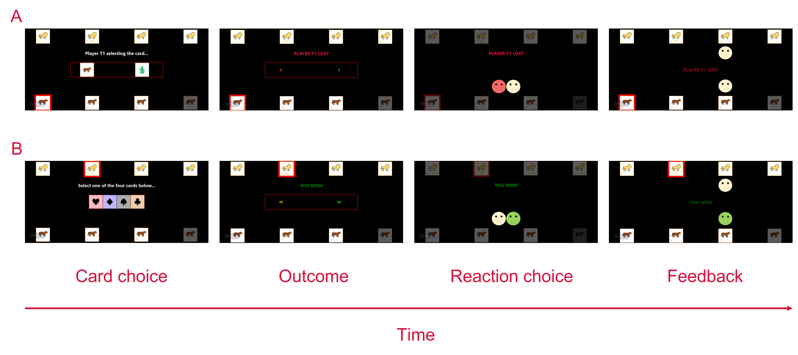

# Empathy learning task (ELT) [Revised]

This repository stores HTML/JavaScript/CSS code for the revised version of the Empathy learning task (ELT).

The revised version of ELT attempts to mimic learning of intergroup empathic norms through making predictions and verifying these predictions through observation. In the task, participants first try to predict how ingroup and outgroup members would emotionally respond to each other’s positive or negative outcomes, after which they receive feedback on their prediction. This task allows examination of how participants learn about operative intergroup empathic norms from individual observations of group members’ emotions and how they adapt to these norms in their own empathic responding. 

General outline of the revised version of ELT:

